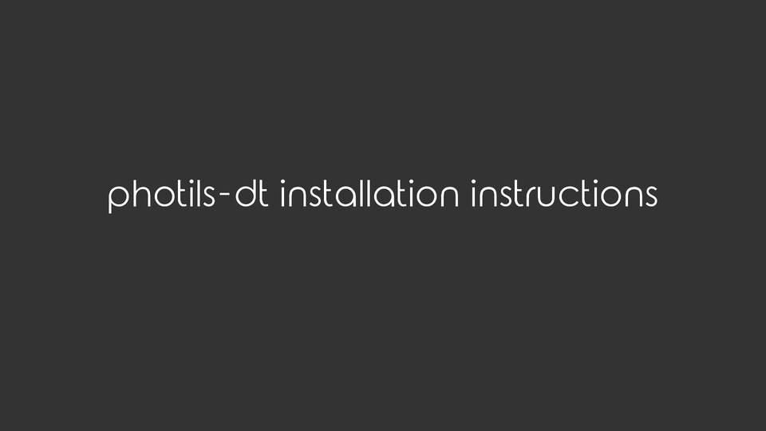

# photils-dt

A darktable plugin that tries to predict keywords based on the selected image. This plugin uses photils-cli to handle this task. Photils-cli is an application that passes the image through a neural network, classifies it, and extracts the suggested tags. Everything happens offline without the need that your data are sent over the internet.

| Platform | Support              |
| -------- | -------------------- |
| Linux    | 
✔️
   |
| MacOS    | 
✔️
   |
| Windows  | 
✔️
 |

## Requirements
* photils-cli - https://github.com/scheckmedia/photils-cli

## Installation

1. check the lua installation instructions - [https://github.com/darktable-org/lua-scripts](https://github.com/darktable-org/lua-scripts)
2. copy photils.lua to contrib of lua-scripts (located at ~/.config/darktable/lua/ for Linux and MacOS)
3. copy photils.po to lua-scripts/locale/de_DE/LC_MESSAGES (optional, for german translation)
4. append `require "contrib/photils"` to ~/.config/darktable/lua/luarc
5. run `darktable -d lua` from the command line to check for some errors
6. download the latest release of [photils-cli](https://github.com/scheckmedia/photils-cli)
    * ***Only relevant for Linux***
    I. copy the binary file at a location of your choice (e.g. ~/Apps)
    II. give the photils-cli.AppImage execution permission (Using the UI or chmod +x photils-cli*.AppImage)
7. set the path to the *.AppImage (Linux) or *.app (MacOS) in the photils widget
8. restart darktable

## Usage
* Select an image
* Press "Get Tags"
* Select the tags you want from a list of suggestions
* Press "Attach .. Tags" to add the selected tags to your image
